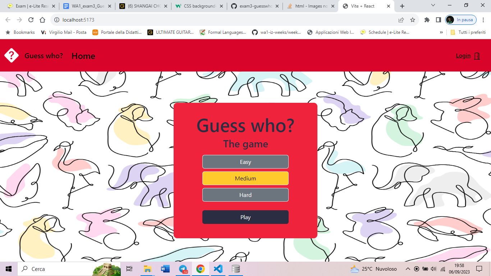
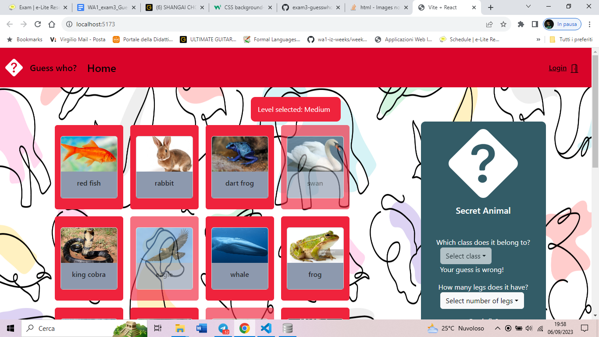

# Exam #3: "Guess who?"
## Student: s308344 SANFRANCESCO FEDERICO 

## React Client Application Routes

- Route `/`: main page, it allows user to play the game, interacting with button cards or asking questions about properties of Secret Animal. The user can restart the game in every moment. A popup appears if the user chooses to leave the game before the end.
- Route `/login`: page used to perform login
- Route `/history`: page that shows list of all matches played by logged user (authenticated route) and total score
- Route `*`: for non existing pages

## API Server

## AUTHENTICATION 

- POST `/api/sessions` 
  Performs the login.
  - request body content  
  {"username": "some", "password": "some"}
  - response body content 
    {"id": ---, "username" }
- GET `/api/sessions/current` 
  Authenticated, returns the information of the authenticated user.
  - response body content 
   { "id": ---, username: --- }
- DELETE `/api/sessions/current` 
  Performs the logout.

## OTHERS
 
- GET `/api/items` NOT AUTHENTICATED, returns the list of all items to play with (proper JSON)
  - response body content 
   [{ "id": -,"name":-, "class": -, "legs": -, "fly": -, "color": -, "extinct": -, "order": -, "url": - }, ..., {...}] 

- GET `/api/item/:id/property/:prop` NOT AUTHENTICATED, returns the property of the item retrieved by id, to make guesses about secret item (proper JSON)
  - requested parameters:  _id_, _prop_ 
  - response body content 
  {property: value}

- GET `/api/history` AUTHENTICATED, returns all played matches with score, date, level, name of secret item of the logged user (proper JSON)
  - response body content
  - success case:
  [{ "id": -,"secretItemId":-, "score": -, "date": -, "level": -, "userId": -}, ..., {...}] 
  - error case:
  { error: `Error performing access to the list of matches for logged user`}

- POST `/api/match` NOT AUTHENTICATED, adds a new match to the matches db with default userID=0 .
  - request body content 
  {"id": integer, "secretItemId": random integer, "score": 0, "date": dayjs(), "level": level, "userId": 0}
  - response body content
  - success case:
   {this.lastId} : id of the last match added
  - error case:
  { error: `Database error during the creation of match with ${item.name} as secret animal.`}
  
- PUT `/api/match/save` AUTHENTICATED, updates entry of the new match with score and save in matches db with userID
  - request body content
  { "matchID": integer, "score": integer, "userId": logged userID }
  - response body content
  - success case:
  {this.changes} : number of affected rows on db table _matches_
  - error case:
  { error: `Database error during the save of last match with score ${req.body.score}.`}

- DELETE `/api/match/reset` NOT AUTHENTICATED, deletes automatically the new match created if the user is not logged in with last matchID (it requires an encrypted parameter to be performed, called _auto_. The parameter has been added to ensure the correct usage of this API, to avoid deletions of non-authorized matches)
  - request parameters and request body content
  {"matchId": integer, "auto": "auto"}
  - response body content
  - success case:
  {this.changes} : number of affected rows on db table _matches_
  - error case:
  { error: `Database error removing last match not authenticated .` }

## Database Tables
(Primary key or foreign key in bold)

- Table `users` - (**id**, nome, email, salt, hash);
It stores the list of users that have an account.
- Table `matches` - (**id**, secretItemId score, date, level, **userId**); 
It stores the list of matches played by all registered users, identified by userId. When a match is played by a non-registered user, it stores temporarily a match played by a generic user with id:0, that will be deleted at the end of the match.
- Table `itemSet` - (**id**, name, class, legs, fly, color, extinct, order, url);
It stores the list of animals, their properties and the url to give the image representation for button cards.
 
LIST OF ANIMAL PROPERTIES:
(Each animal has a unique combination of these properties)
  - which class does it belong to?
  - how many legs does it have?
  - can it fly?
  - what color is it?
  - is it extinct?
  - which order does it belong to?

matches(**userId**) refers to users(**id**);

Fly: 0 false, 1 true - extinct: 0 false, 1 true
Level difficulty: 1 easy, 2 medium, 3 hard

## Main React Components

- `Game` (in `Home.js`): this component handles the main functionalities of the game, returns the cards and the secretItem card so that the player can click on cards and make trials or ask to the server infos about secret item properties and receive answers. It has states for _itemlist_,  _level_ of the match and performs restart of the entire game. States _endgame_ and _play_ handle the single match, while _clicked_ handles the number of trials of the user. 
Finally, _win_ is the state that gives the final result of the match and triggers the restart process.  
- `NavBar` (in `Home.js`): it is the navbar of the GUI, handles the routes of History, Home, Login. It has pop-ups in case of leaving the page in the middle of the game.
- `History` (in `History.js`): this component handles the list of all matches played by userId, this route appears only with an authenticated user logged in and is refreshed every time is called and every time the user plays a new match.
- `LoginForm` (in `LoginForm.js`): this component handles login and logout operations

## Screenshot

## Users Credentials

  Name, username, password 
- luigi, luigi@test.com, pwd
- mario, mario@test.com, pwd
- frank, frank@test.com, pwd

